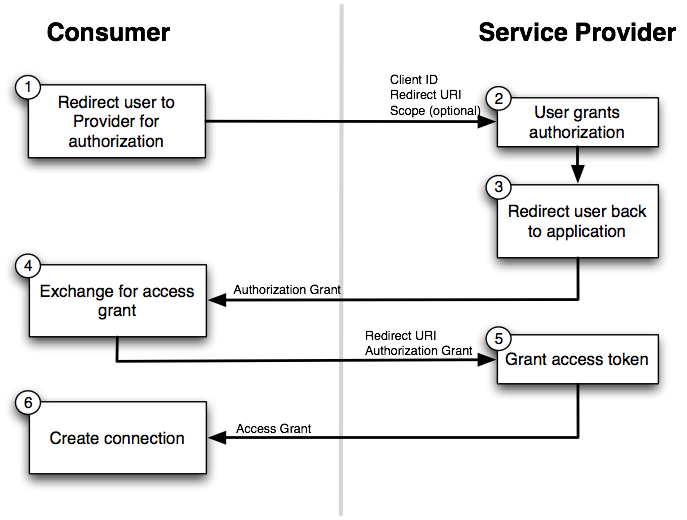

title: Codeweekend APIs Workshop
author:
  name: Lewis Ellis
  twitter: LewisJEllis
  url: http://LewisJEllis.com
output: workshop3.html
controls: true

--

# APIs 101

--

### Make sure you have:

* Node.js ready to go
* The files for this workshop downloaded
  - See http://the-dining-philosophers.github.io/code-weekend
* Some sort of text editor, with those files open
* A Venmo account

--

### Topics to cover:

* What is an API? How do they work? How do I use them?
* Sending emails using Nodemailer
* Sending HTTP requests from Node.js
* OAuth tokens and how 'the OAuth dance' works
* Using Venmo's API to send payments

--

### Hopefully you're comfortable with:

- Node.js basics
- Storing data in sessions
- Creating and processing forms

We're using yesterday's finishing point as today's starting point. Like yesterday, we have milestones to jump to if you get behind or need to copy/paste something.

We'll start by going over the application from the end of Workshop 2 to make sure everyone is familiar.

--

### Background: API

An **API** (Application Programming Interface) is essentially a way for you to plug in a wire from your application/library/code to someone else's, enabling communication between them.  then communicate between them.

--

In the context of a hackathon, that 'someone else' is typically a 3rd-party service such as:
* Venmo
* Dropbox
* Twilio
* Twitter
* Spotify/Rdio

--

### What we'll ultimately build

By the end of this session, our application will be able to:
* Send emails
* Do the OAuth dance with Venmo
* Use the Venmo API to send payments

--

### Things we'll use to do that
* Packages
  * Nodemailer
  * request
* Venmo app, which you can

--

### Milestone 1

* Get Nodemailer working and connected to Gmail
  * `npm install --save nodemailer`
* Send a fixed email to an email address provided by the user

--

### Milestone 2

* Send a note as an email instead
* Add a 'send this note' form to the note view

--

### Milestone 3

* Authenticate with Venmo
  * `npm install --save request`
* Store the Venmo credentials in the session
* Create a venmo page for sending payments

--

### OAuth

--

### Venmo's API
* https://developer.venmo.com/
* Request authorization: https://api.venmo.com/v1/oauth/authorize?client_id=...&scope=make_payments%20access_profile&response_type=code
* Venmo redirects back to our endpoint, /venmo/oauth?code=...
* Get access token: https://api.venmo.com/v1/oauth/access_token?code=...
* Provide access token to: https://api.venmo.com/v1/payments

--

# Questions?
